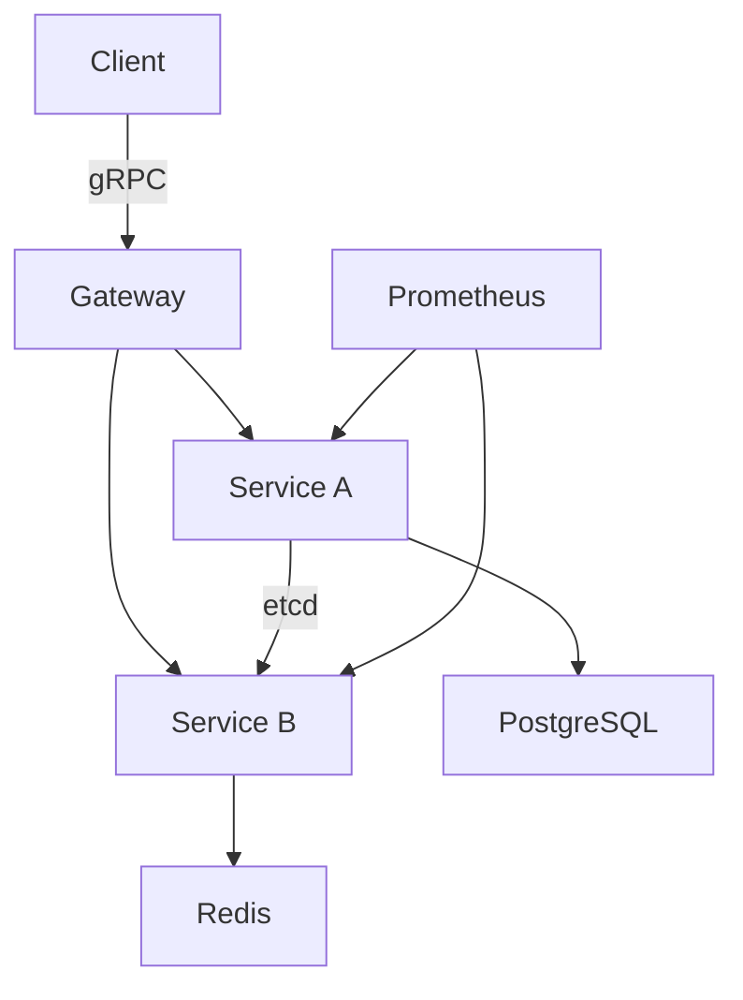

# pluggable-stack-epxdz5

   

> A pluggable stack for cloud-native service orchestration.

`#typescript` `#streaming` `#data-engineering` `#python` `#kubernetes`

## Features

- Service mesh with automatic peer discovery via etcd
- gRPC bidirectional streaming for real-time data
- Built-in rate limiting with token bucket algorithm
- Graceful shutdown with connection draining
- Prometheus metrics with custom histogram buckets

## Tech Stack

`Go` · `gRPC` · `Protocol Buffers` · `etcd` · `Prometheus`

## Quick Start

```bash
go mod download
```
```bash
go generate ./...
```
```bash
make proto
```
```bash
go run ./cmd/server
```

## Architecture



## Development

```bash
# Run tests
make test

# Lint
make lint

# Type check
make typecheck

# Build
make build
```

## Contributing

1. Fork the repository
2. Create a feature branch (`git checkout -b feat/amazing-feature`)
3. Commit changes (`git commit -m 'feat: add amazing feature'`)
4. Push to branch (`git push origin feat/amazing-feature`)
5. Open a Pull Request

## License

Distributed under the MIT License. See `LICENSE` for more information.

---

Built with ❤️ using Go and gRPC
